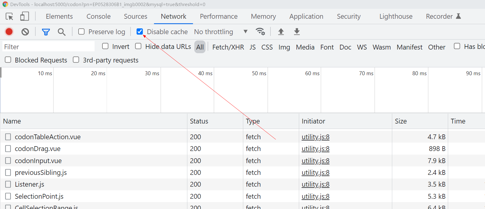

# 
 Deployment Manual for javaScript

## javaScript

### 开发环境安装  
https://nodejs.org/en/docs/  

### 开发工具设置

#### windows

https://blog.csdn.net/qq_48485223/article/details/122709354  

npm config get registry  

npm config set registry https://registry.npm.taobao.org/  

npm config set prefix "D:\Program Files\nodejs\node_cache"  

npm config set prefix "D:\Program Files\nodejs\node_global"  

npm install -g cnpm --registry=http://registry.npm.taobao.org  

cnpm install -g vue-cli 
或者   
npm install -g vue-cli  

cnpm install webpack -g  
或者  
npm install webpack -g  

webpack -v  
然后输入  
yes  
之后自动下载资源。  

vue creat myproject  

npm run serve
npm run dev  
创建发行版本：  
npm run build  

disable cache when debugging in Chrome:  
  